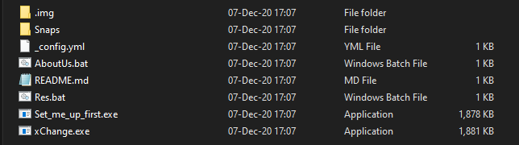
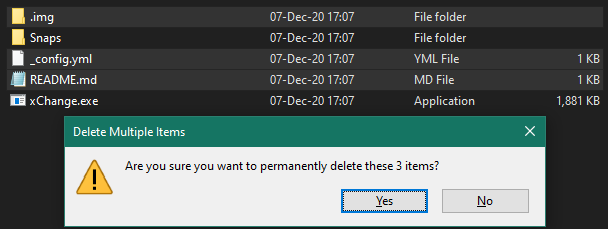
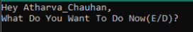
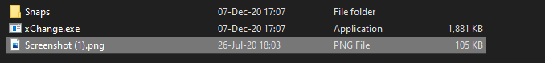
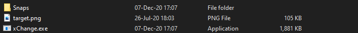
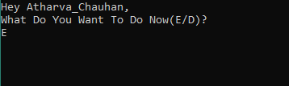
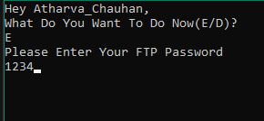
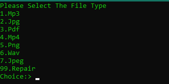
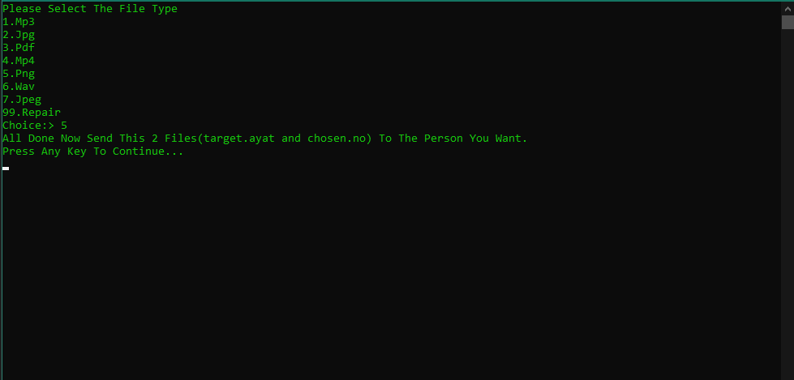

# Welcome to SecureDataxChange 

_Your One Stop Destination For Exchanging Data Securely_

## What Is Data Exchange?

Data Exchange doesn't mean that it must be very High level data sharing it can also be at low level
For Eg- Sharing Private photos videos and also confidential documents.

No One Can open or read them not even AYSOAT.  

## Steps To Do That 

### Step 1
  Clone or download this repository (SecureDataxChange)

### Step 2
  Open The Folder 📂 Now You Can Find Some Items There You Go With Set_Me_Up_First.exe And Setup The Things...
  We Know That You Can Do This steps
   

### Step 3
  Now You Can Delete Some UnWanted Files...But be sure that you don't delete the main files. 
  The Folder Snap Contains All Snapshots Of Every Step So If It Is Important You Think Then Keep Otherwise You Can Delete It Too..
   
  

### Step 4
Now You Will Run "xChange.exe" Which Is The Important File. Remember That You Cannot Relocate Those Files...
When You Will Run This You Will Get Question That What Do You Want To Do?(E/D)
Here E stands for encrypt
and  D stands for decrypt
You Can Encrypt Many File Formats
 
If you want to decrypt any document then, now you can move towards the Decryption part...
   
  
  
### Step 5
  You Can Take Any File type.. I would like to go with PNG.
  
### Step 6
  Now First Paste The File That You Want To Encrypt In That Folder and Rename it As target.
  
### Step 7
  Now Open The File Named "xChange.exe" And Press E And Hit Enter....
   
  
   
  Now Enter The FTP Then Hit Enter..
   
  
### Step 8
  Now Choose What File Type Do You Want To Encrypt.. I Have Taken PNG so I will go with it...
   
  
### Step 9
  
## Now The Step Of Encryption is completed you can zip those two(Chosen.no & target.ayat) files and share With Whom you want to exchange data securely..

# Steps of Decryption Are Damn Easy!

### Step 1 
  If you have recieved the zip file, then first download and setup the SecureDataxChange software...
   
### Step 2
  Now extract the zip file in where you have setup the SDE.
### Step 3
  Now you will see that there are 2 new files there, target.ayat and Chosen.no... So neglect it and move towards the xChange.exe..
### Step 4
  After runnung it you will see this screen again.
   
  
   
  Now you will choose D(Decrypt) here....
### Step 5 
  As soon as you choose D you will be asked for your password, and your file named target would be ready...

## You are done with decrypting your file...

### Didn't Understand?, No worries You can also go with our [youtube video tutorial](https://www.youtube.com/watch?v=27G9RAXx44c)

### Support or Contact

You Can [Telegram](https://t.me/MRTAG08) us.

